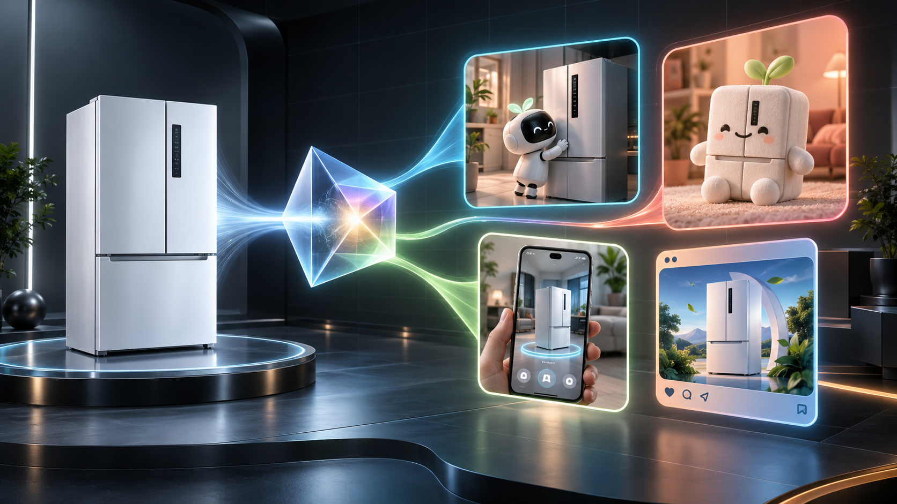

# 卖点有戏·AI 互动营销工作室｜初步方案

版本：0.1｜阶段：概念验证与参赛立项

## 1. 一句话与电梯陈述

**卖点有戏**是一家由一名创意经营者和一组 AI Agent 组成的虚拟一人公司：用户只需提交家电产品图、资料与想强调的卖点，就能把静态参数转成可玩的桌宠、网页互动、AR 体验、社媒内容或衍生品概念。

它解决的不是“再生成一张图”，而是三件更难的事：从资料中找出可信卖点、为卖点选择最合适的互动表达、把创意打包成能评审和继续生产的交付物。

## 2. OPC 基本信息

| 项目 | 定义 |
|---|---|
| 虚拟一人公司名称 | 卖点有戏·AI 互动营销工作室 |
| 产品名 | 卖点有戏 HookPlay |
| 经营者角色 | 超级个体：创意总监、客户经理、最终责任人 |
| 核心业务 | 家电卖点识别、互动创意匹配、多形态样稿生成与合规交付 |
| 核心客户 | 公司内部产品经理、品牌/营销经理、区域内容团队；成熟后可扩展至家电品牌与营销服务商 |
| 核心承诺 | 一次输入，形成一套可验证、可体验、可复用的卖点互动方案 |
| 首个样板 | 冰箱产品图 + “AI 保鲜”卖点 + 原创牛来角色 + 网页互动/桌宠 |

## 3. 背景与痛点

### 3.1 传统流程

一个家电新品从参数到互动传播，通常要跨越产品经理、研发/技术专家、用户研究、营销策划、文案、设计、动效/开发、法务与项目管理等角色。信息在简报、群聊、表格与版本文件之间反复传递，常见结果是：

1. 参数很准确，但用户听不懂，也记不住。
2. 创意很热闹，但卖点与产品证据脱节。
3. 海报、短视频、互动页各自重做，难以复用。
4. IP、功效表述和 AI 生成标识在最后阶段才被发现，返工成本高。
5. 小项目凑不齐完整团队，产品经理只能停在“想法”而非“可体验样稿”。

### 3.2 待验证基线

以下是 MVP 立项假设，需用公司真实项目回填：传统首版方案需要约 6–9 个角色、8–15 次交接、5–10 个工作日；目标是让一名业务负责人借助 Agent 矩阵，在 30–90 分钟内得到方案，在 0.5–1 个工作日内得到首个可互动样稿。

## 4. 用户任务与产品流程

### 输入

- 必填：产品外观图至少 1 张、产品类别。
- 强烈建议：细节图、规格书/上市资料、目标市场、传播渠道。
- 可选：希望强调的卖点、原始证据、受众、创意想法、允许使用的品牌/IP 资产。

### 四步体验

1. **看懂产品**：识别品类、结构、功能线索和可视元素；无法由图片证明的能力明确标为“待资料确认”。
2. **锁定卖点**：AI 给出候选卖点，用户可勾选、改写或新增；每条卖点绑定证据与风险等级。
3. **匹配玩法**：从“角色联动、技术可视化、生活场景、游戏化挑战、触觉衍生”等母题组合互动形式与风格。
4. **生成交付**：输出创意方案卡、分镜/交互说明、视觉样稿、渠道适配建议和合规清单。

### 输出包

- 一页卖点策略卡：目标人群、核心卖点、证据、表达主张。
- 三套创意方向：保守可落地、平衡推荐、先锋破圈。
- 一个可体验样稿：首期为网页互动；桌宠作为差异化展示。
- 多渠道文案与画面提示词。
- 资产清单、AI 生成标识、IP/广告合规检查与版本记录。

## 5. 玩法引擎：把卖点变成行为

核心原则是“卖点必须被用户做出来或看见”，而不是只写在标题上。

| 卖点类型 | 互动机制 | 适合形态 | 例子 |
|---|---|---|---|
| 保鲜/恒温 | 时间对比、状态恢复、守护任务 | 网页互动、桌宠、AR | 牛来定时查看食材状态，用户完成“锁鲜任务” |
| 节能 | 能量管理、积分累积、峰谷挑战 | 小游戏、桌面组件 | 调整运行策略，让一天能耗曲线变绿 |
| 静音 | 声音前后对比、安静场景守护 | 声音互动、短视频 | 不吵醒睡着的牛来 |
| 大容量 | 空间整理、装载挑战、收纳规划 | H5、小游戏 | 在限定时间把一周食材合理装入 |
| 自清洁 | 污渍消除、可视化路径、维护提醒 | 桌宠、动效、AR | 角色触发清洁光路并解释流程 |
| 智能识别 | 识别—建议—执行闭环 | 对话角色、网页模拟 | 拍摄食材后生成分区与保鲜建议 |
| 舒适送风 | 气流可视化、体感选择、场景切换 | AR、动画、互动屏 | 用户移动角色，观察不同位置的风感 |

## 6. 差异化

1. **不是模板套图**：先建立“卖点—证据—受众—机制—渠道”的结构化链路。
2. **不是只给文案**：交付物包含可体验互动和继续生产所需的规格。
3. **不是黑盒生成**：用户在卖点确认、创意确认、发布确认三个节点拥有最终决策权。
4. **不是依赖某个模型**：视觉理解、文本策划和图像生成均通过适配层替换，便于迁入公司平台。
5. **从源头合规**：原创新角色优先；现成 IP 必须上传授权范围；功效声称必须绑定来源。

## 7. 商业价值

### 效率与成本

- 把串行交接改为 Agent 并行准备、总控汇总、人类三次确认。
- 同一份结构化卖点资产复用于桌宠、网页、社媒、短视频分镜和衍生品概念。
- 早期先生成低成本样稿，评审通过后再进入高成本制作。

### 增长

- 将技术语言变成可分享、可记忆、可参与的用户体验。
- 针对人群、区域与渠道生成不同表达，但保持同一证据源与品牌约束。
- 通过互动完成率、卖点记忆率、分享率与后续转化建立创意效果闭环。

### 可复用/可扩展

- 品类从冰箱扩到洗衣机、空调、厨电、清洁电器。
- 形态从网页/桌宠扩到 AR、零售大屏、智能包装、短视频和实体衍生品。
- 企业可沉淀品牌词库、禁用词、产品知识库、角色设定与渠道模板。

## 8. 收益模式

参赛阶段以内部价值为主，商业化可分三层：

1. 个人/小团队：基础订阅 + 生成额度。
2. 企业团队：席位 + 品牌资产库 + 审批流 + 私有知识库。
3. 定制服务：原创角色、复杂互动、私有化部署和大型活动整案。

## 9. 合规红线

- 图片只能识别“可见事实”；技术性能必须来自规格书、检测报告或正式产品资料。
- 禁止模型自行创造“第一、最佳、零耗能、绝对保鲜”等无法验证表述。
- 热门/经典角色只作为创意检索方向；无授权时必须自动替换为原创角色原型。
- 对外发布的 AI 生成图片、视频、音频与虚拟场景，需要保留显式/隐式标识能力。
- 产品图、未上市资料和用户数据按公司数据分级决定是否允许发送到外部模型。

## 10. 成功标准

第一阶段不把“生成数量”当成功，验证以下五项：

| 指标 | MVP 目标 | 测量方式 |
|---|---:|---|
| 首版方案时间 | ≤ 90 分钟 | 从资料齐备到三案输出 |
| 人工有效操作 | ≤ 20 分钟 | 上传、选择、修改、确认总时长 |
| 卖点证据绑定率 | 100% | 每条对外主张都有来源或被标记待核 |
| 一次评审通过率 | ≥ 60%（假设） | 内部 5–10 个真实任务试点 |
| 卖点记忆提升 | ≥ 20%（假设） | 互动样稿与静态物料小样 A/B 访谈 |

这些数值是挑战目标，不应在路演中表述为已实现数据，除非后续测试提供证据。
