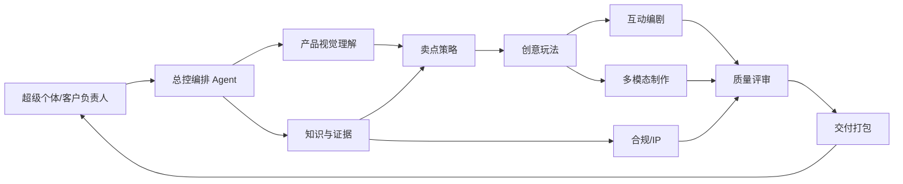

# AI Agent 矩阵与全流程

## 1. 组织模型

超级个体不是“一个人做所有细节”，而是一个人承担目标、取舍和责任；Agent 承担识别、检索、发散、生产、校验与打包。



## 2. 角色矩阵

| Agent | 过去对应角色 | 输入 | 核心任务 | 输出 | 必须升级给人 |
|---|---|---|---|---|---|
| 总控编排 Agent | 项目经理/客户经理 | 任务、渠道、截止时间 | 拆解任务、并行派单、状态汇总、版本管理 | 工作流状态、决策摘要 | 范围冲突、资料缺失、预算变化 |
| 产品视觉理解 Agent | 产品/工业设计助理 | 外观图、细节图 | 识别结构、材质、部件、可互动区域 | 视觉观察清单、待确认项 | 型号不确定、遮挡、无法从图证实 |
| 知识与证据 Agent | 研发接口/资料员 | 规格书、检测材料、知识库 | 提取参数，给每条主张绑定来源 | 证据卡、可信度、禁用表达 | 多来源冲突、涉密资料 |
| 卖点策略 Agent | 市场策略/用户研究 | 证据卡、受众、场景 | 卖点聚类、利益翻译、优先级排序 | 主卖点、辅助卖点、用户收益 | 缺少目标受众或竞争背景 |
| 创意玩法 Agent | 创意总监 | 卖点结构、渠道限制 | 将卖点映射为互动机制、风格和载体 | 保守/平衡/先锋三案 | 需使用现成 IP、超预算形态 |
| 互动编剧 Agent | 文案/交互设计 | 选定方案 | 设计状态、动作、反馈、文案与分镜 | 互动脚本、状态机、界面文案 | 可能误导用户的拟人化表达 |
| 多模态制作 Agent | 设计/动效/前端 | 脚本、品牌规范 | 生成概念图、素材、页面样稿和开发规格 | 视觉样稿、网页包、提示词 | 品牌一致性不足、产品变形 |
| 合规与 IP Agent | 法务/品牌审核 | 主张、素材、IP 选择 | 查证授权、广告表述、AI 标识与数据边界 | 风险清单、修改建议、发布条件 | 任何高风险项都不能自动放行 |
| 质量评审 Agent | QA/创意评审 | 全部候选产物 | 检查卖点一致性、可用性、跨渠道适配 | 分数、缺陷、返工指令 | 低于阈值或意见冲突 |
| 交付打包 Agent | 运营/制片 | 已批准产物 | 命名、打包、生成说明、保留追溯信息 | 可下载交付包、复用模板 | 对外发布前最终确认 |

## 3. 三个人工闸门

### 闸门 A：卖点确认

用户确认“我们究竟在说什么”。没有证据的卖点只能作为创意假设，不能进入对外文案。

### 闸门 B：创意确认

用户在三案中选择方向，并确定预算、渠道、风格、角色/IP 路线。Agent 可推荐，不能代替品牌判断。

### 闸门 C：发布确认

用户审阅成品、声明与授权，决定“能否发布”。系统保存批准人、时间、版本和证据链。

## 4. 协同协议

所有 Agent 通过同一任务对象协作，避免各自输出长文：

```json
{
  "project_id": "demo-fridge-001",
  "product": {"category": "refrigerator", "model": "待确认"},
  "audience": ["年轻家庭"],
  "claims": [
    {
      "claim": "AI保鲜",
      "evidence_id": "doc-01-p12",
      "status": "pending_human_approval",
      "risk": "medium"
    }
  ],
  "concept": {
    "mechanic": "食材守护任务",
    "format": ["web_interaction", "desktop_pet"],
    "style": "原创治愈3D"
  },
  "approval_gate": "B"
}
```

关键规则：

- 结构化 JSON 是单一事实源；Markdown/PPT/网页都从中派生。
- 每条卖点有 `evidence_id`、状态和风险等级。
- Agent 只写自己负责的字段，不覆盖他人已批准内容。
- 任何高风险项触发人工确认，不能靠“再问一次模型”自动消除。

## 5. 端到端步骤

1. 总控读取任务，检查输入完整度。
2. 视觉理解与资料解析并行工作。
3. 证据 Agent 合并两路结果，区分可见事实、资料事实和假设。
4. 策略 Agent 生成“功能 → 用户利益 → 传播主张”。
5. 用户完成闸门 A。
6. 创意 Agent 为每个核心卖点生成三档方案并评分。
7. 合规 Agent 在创意阶段同步标注 IP、广告与数据风险。
8. 用户完成闸门 B。
9. 互动编剧与多模态制作并行生成样稿和规格。
10. QA 对照卖点、品牌、可用性和渠道规格评分；不合格项定向返工。
11. 用户完成闸门 C。
12. 打包 Agent 生成交付物、版本清单与复用模板。

## 6. 技术实现路径

### MVP 架构

- 前端：React/Vite 或公司平台兼容的 Web 组件；首期提供图片/资料上传、四步向导、方案卡和预览。
- 服务层：FastAPI/Node 任一轻服务，暴露任务、资产、审批与导出接口。
- 编排层：显式状态机优先；需要复杂回退时再引入 LangGraph 类框架。
- 模型适配层：视觉理解、文本推理、图像生成分开配置，兼容公司内模与外部 API。
- 知识层：产品资料切片、结构化参数表、品牌词库、禁用词和授权资产索引。
- 生成层：图片模型 + 可替换的 ComfyUI 工作流；互动网页由受控组件模板生成，而非任意代码直出。
- 存储：对象存储保存图片/导出包，PostgreSQL 保存项目、主张、审批和审计记录。

### 为什么先生成“受控互动模板”

直接让模型生成任意前端代码很难保证稳定、安全和迁移。MVP 先提供 6 个机制模板：拖拽收纳、前后对比、点击探索、时间守护、参数滑杆、角色状态机。Agent 只填内容、素材和参数，既能展示智能，也便于公司平台接入。

## 7. 失败与降级

| 失败情形 | 系统行为 |
|---|---|
| 图片无法确认型号 | 只描述可见结构，要求用户补充型号/资料 |
| 卖点无证据 | 标记“仅创意假设”，禁止进入对外成品 |
| 请求知名 IP 但无授权 | 提供原创角色替代，不生成相似角色 |
| 角色化后失去产品识别度 | 视觉 Agent 对“产品原图｜角色定妆”对照板评分；低于 7/10 时携带缺失特征自动定向重绘一次，仍不通过则停止而不是把原图贴入成品 |
| 内部资料不可出域 | 切换内模/本地工作流，或仅上传脱敏摘要 |
| 某模型不可用 | 通过适配层切换供应商；保留任务状态以便续跑 |
